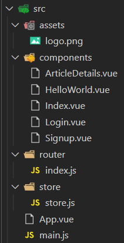

# web

> Service Computing hw09

- [对应博客](https://blog.csdn.net/try17875864815/article/details/111414404)

**文件说明**

> 主要文件在`src`目录下，其余均为Vue构建自动生成，其中结构及对应页面如下

- Signup.vue：注册页面

- Login.vue：登录页面 

- Index.vue：主页面

- ArticleDetails.vue：文章页面

- HelloWorld.vue：自动生成的页面，用于测试

- main.js为项目的核心文件

- App.vue为项目入口文件




**使用说明**

- 使用命令`npm install`安装好对应的依赖

- 使用命令`npm run dev`运行项目后进入网址`localhost:8080`即可

## Build Setup

``` bash
# install dependencies
npm install

# serve with hot reload at localhost:8080
npm run dev

# build for production with minification
npm run build

# build for production and view the bundle analyzer report
npm run build --report

# run unit tests
npm run unit

# run e2e tests
npm run e2e

# run all tests
npm test
```

For a detailed explanation on how things work, check out the [guide](http://vuejs-templates.github.io/webpack/) and [docs for vue-loader](http://vuejs.github.io/vue-loader).
